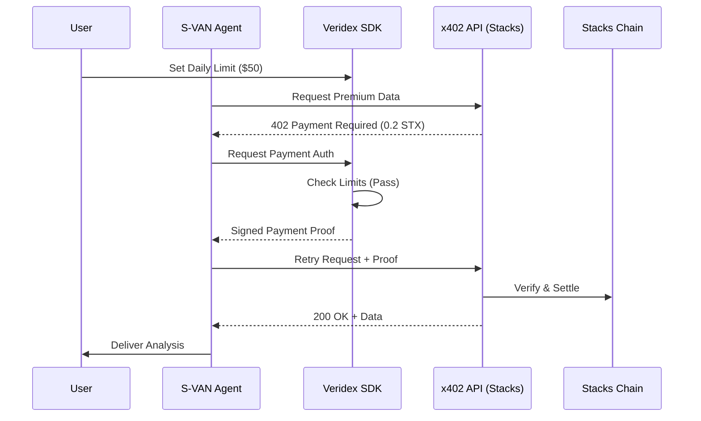

# S-VAN Technical Architecture

## System Components

### 1. Veridex Agent SDK Core
The foundation of S-VAN is the `VeridexAgent` class from `@veridex/agent-sdk`. We extend its capabilities with a `StacksChainClient`.

```typescript
import { createAgentWallet } from '@veridex/agent-sdk';
import { StacksChainClient } from './chains/StacksChainClient';

const agent = await createAgentWallet({
  masterCredential: { ... },
  session: {
    dailyLimitUSD: 100,
    perTransactionLimitUSD: 10,
    allowedChains: ['stacks-mainnet']
  },
  customChains: [new StacksChainClient()]
});
```

### 2. x402-Stacks Integration
We implement a custom `X402StacksAdapter` that translates standard x402 headers into Stacks transactions.

**Flow:**
1. **Intercept**: `agent.fetch()` catches the 402 response.
2. **Parse**: `PaymentParser` extracts `stx-address`, `amount`, and `memo`.
3. **Authorize**: `SessionKeyManager` verifies the limit and signs the authorization.
4. **Settle**: The signed authorization is sent to the Stacks x402 Facilitator.

### 3. Smart Spending Monitoring
Using Veridex's `AuditLogger` and `AlertManager`, S-VAN provides real-time visibility into agent spending.

- **Threshold Alerts**: Notifies the owner when 80% of the daily limit is reached.
- **Compliance Export**: Generates a cryptographically signed report of all x402 payments for tax/accounting purposes.

## Sequence Diagram



## Security Model
- **Non-Custodial**: The master key remains in a secure enclave; the agent only uses session keys.
- **Hardware-Backed**: Supports WebAuthn/Passkeys for session initialization.
- **Bounded Autonomy**: The agent can only spend up to the user-defined limit, preventing catastrophic loss from bug or prompt injection.
